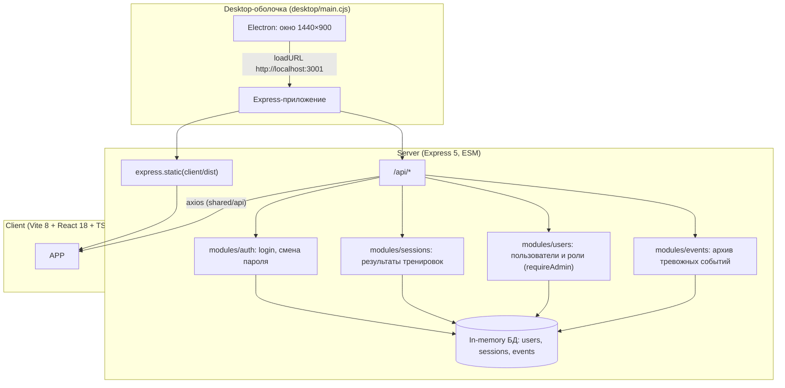
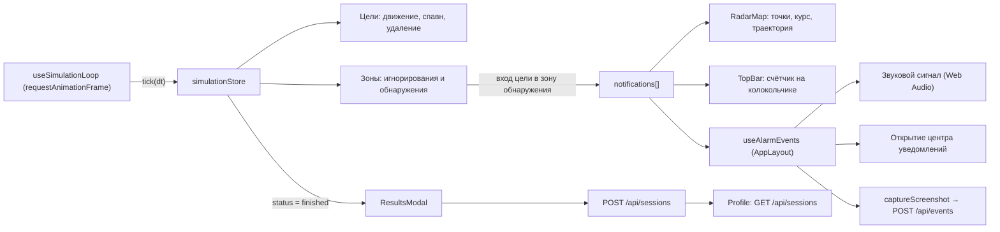
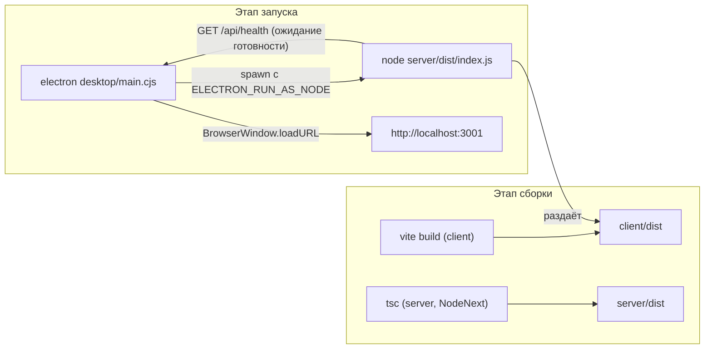

# Архитектура приложения

Документ описывает схему архитектуры (п.4.1 ТЗ): составные части приложения, их
взаимодействие и ключевые технические решения.

## 1. Общая схема

Приложение состоит из трёх частей: клиент (SPA), сервер (API + раздача статики)
и десктопная оболочка Electron, которая объединяет их в один исполняемый продукт.

## 2. Слои клиента (FSD-подобная структура)

Импорты разрешены только «вниз»: `app → pages → widgets → features → entities → shared`.

```mermaid
flowchart TB
  subgraph app["app/"]
    MAIN["main.tsx: bootstrap + ErrorBoundary + глобальный L для leaflet-rotate"]
    APPX["App.tsx: маршруты react-router 7"]
    LAYOUT["AppLayout.tsx: TopBar + SideMenu + NotificationsPanel + Outlet"]
    GUARD["ProtectedRoute.tsx: проверка JWT-сессии"]
  end

  subgraph pages["pages/"]
    P1["Login"]
    P2["MainMenu"]
    P3["Simulation"]
    P4["Profile"]
    P5["Settings"]
  end

  subgraph widgets["widgets/"]
    W1["Map (RadarMap)"]
    W2["MapControls: компас, поворот, «Дом»"]
    W3["TopBar: таймер, пауза, дата/время, колокольчик"]
    W4["SideMenu"]
    W5["NotificationsPanel + EventPreviewModal"]
    W6["SimulationSettingsMenu"]
    W7["TrainingSetupModal"]
    W8["ResultsModal"]
    W9["StatsChart / UsersPanel"]
  end

  subgraph features["features/"]
    F1["simulation: simulationStore, useSimulationLoop (RAF), uiStore, config, targetFactory"]
    F2["settings: settingsStore (persist в localStorage)"]
    F3["auth: authStore, authApi"]
    F4["events: eventsStore, captureScreenshot, eventsApi"]
    F5["users: usersApi"]
  end

  subgraph entities["entities/"]
    E1["user / target / session / event — только типы"]
  end

  subgraph shared["shared/"]
    S1["api: axios-клиент с интерцептором JWT"]
    S2["lib: geo, units, sound, useNow, useHotkey"]
    S3["ui: Loader"]
  end

  app --> pages --> widgets --> features --> entities --> shared
```

## 3. Поток данных режима «Тренировка»

Сеанс — это RAF-цикл, который двигает цели, проверяет зоны и наполняет стор.
Все виджеты читают состояние из стора Zustand, поэтому карта, HUD и центр уведомлений
обновляются из одного источника правды.

### Правила, реализующие требования ТЗ

| Правило | Где реализовано |
| --- | --- |
| БВС: прямая траектория к РЛС, 25–35 м/с, средняя дистанция обнаружения | `features/simulation/lib/targetFactory.ts`, `config.ts` |
| Птицы: кривая траектория, 2–10 м/с, любая дистанция, на РЛИ не более 10 с | `targetFactory.ts` (`BEHAVIOR`) |
| До 20 точек на карте одновременно | `simulationStore.tick` (`maxConcurrent`) |
| Вход в зону обнаружения → уведомление и звук | `simulationStore.tick`, `useAlarmEvents` |
| Цели в зоне игнорирования скрыты, уведомления по ним не создаются | `RadarMap` (фильтр), флаг `ignored` в сторе |
| Определение БВС — двойной щелчок, верным считается только БВС | `RadarMap` (`dblclick`), `simulationStore.identify` |
| Направление и траектория — при включённых настройках | `RadarMap` (шеврон полилинией, `trajectory`) |

## 4. Схема развёртывания

## 5. API

Все защищённые маршруты требуют заголовок `Authorization: Bearer <JWT>`.

| Метод | Маршрут | Доступ | Назначение |
| --- | --- | --- | --- |
| `POST` | `/api/auth/login` | публичный | Вход, выдача JWT (срок 12 ч) |
| `GET` | `/api/auth/me` | авторизованный | Проверка сохранённой сессии при запуске приложения |
| `POST` | `/api/auth/password` | авторизованный | Смена пароля |
| `GET` | `/api/sessions` | авторизованный | История тренировок текущего пользователя |
| `POST` | `/api/sessions` | авторизованный | Сохранение результатов сеанса |
| `GET` | `/api/users` | администратор | Список пользователей |
| `POST` | `/api/users` | администратор | Создание пользователя |
| `PATCH` | `/api/users/:id` | администратор | Смена роли/имени |
| `DELETE` | `/api/users/:id` | администратор | Удаление пользователя |
| `GET` | `/api/events` | авторизованный | Архив тревожных событий со снимками |
| `POST` | `/api/events` | авторизованный | Добавление события (снимок экрана) |
| `DELETE` | `/api/events` | авторизованный | Очистка архива |
| `GET` | `/api/health` | публичный | Проверка готовности (использует Electron) |

Валидация входных данных — `zod` на каждом маршруте, пароли — `bcryptjs`,
токены — `jsonwebtoken`. CORS ограничен локальными источниками (`localhost`).
Публичное представление пользователя формируется в `shared/mappers.ts`, чтобы хеш пароля
не мог попасть в ответ по неосторожности.

## 6. Ключевые технические решения

- **Единый источник правды для сеанса.** Движок вынесен в Zustand-стор вне React:
  RAF-цикл вызывает `tick(dt)`, компоненты лишь подписываются на нужные срезы.
  Это исключает рассинхронизацию карты, таймера и центра уведомлений.
- **Иконки маркеров кэшируются по цвету.** Leaflet пересоздаёт DOM-узел при смене
  объекта иконки, поэтому при обновлении целей каждые 16 мс новые объекты иконок
  приводили к пересборке маркеров и «миганию» подсказок.
- **Статические стили слоёв вынесены из рендера** (`RING_STYLE`, `DETECTION_STYLE`, …):
  иначе Leaflet применял `setStyle` к слоям на каждом кадре.
- **Карта изолирована в отдельный stacking context** (`z-index: 0`), потому что панели
  Leaflet имеют `z-index: 400+` и перекрывали накладные элементы страницы.
- **Реакция на изменение размеров контейнера.** Leaflet отслеживает только изменение окна,
  поэтому `MapBridge` подписывается на `ResizeObserver` и вызывает `map.invalidateSize()`
  (открытие/закрытие центра уведомлений меняет ширину карты).
- **`leaflet-rotate` подключается после публикации глобального `L`.** Плагин реализован как
  классический плагин Leaflet и обращается к глобальной переменной, поэтому `main.tsx`
  сначала публикует модуль Leaflet, затем динамически импортирует плагин и только после
  этого рендерит приложение.
- **Снимок экрана для архива** делает `modern-screenshot` в формате JPEG: он встраивает
  внешние изображения (тайлы карты), для которых настроен CORS. Размер задаётся через `scale`
  (множитель DPI), а не через `width`: `width` задаёт ширину узла перед рендером, поэтому при
  широком окне правая часть интерфейса обрезалась, а при узком в кадр добавлялась пустая полоса.
  Сейчас в кадр всегда попадает весь интерфейс: широкие окна уменьшаются до 960 px по ширине,
  узкие сохраняются 1:1.
- **Отметки целей на снимке** строятся обычными элементами страницы, а не слоями карты:
  инструмент снимка переносит содержимое страницы, но пропускает слои, добавленные внутрь
  контейнера карты, поэтому без отметок кадр показывал бы карту без целей. Экранная позиция
  берётся у временного маркера Leaflet — так смещение, масштаб и поворот карты учитывает сама
  библиотека, а не ручная проекция координат. Цель, вызвавшая тревогу, выделяется кольцом с
  подписью сектора и скорости, остальные видимые цели — кольцами без подписи. Отметки удаляются
  сразу после снятия кадра.
- **Сервер собирается в ESM для Node** (`module: NodeNext`): относительные импорты
  указываются с расширением `.js`, что гарантирует работоспособность `node dist/index.js`.
- **Палитра приведена к референсным экранам**: тёмно-синяя панель сверху `#00266d`,
  светлые поверхности `#f4f4f4` / `#eaeaea`, акцент `#0048c0`, опасность `#c62828`, зона
  обнаружения на карте — красный полигон, радарные кольца — белые. Базовые токены заданы
  переменными в `shared/styles/global.css`, поэтому смена оформления не требует правки компонентов.
- **Хранилище in-memory** — осознанное решение для тренажёра: состояние создаётся при
  старте процесса и не требует внешней БД при демонстрации. Размер истории ограничен
  (`LIMITS` в `server/src/shared/db.ts`), а сохранённая сессия клиента проверяется через
  `GET /api/auth/me`: токен прошлого запуска не даёт «висящего» авторизованного состояния.
- **Строгость типов и линтера.** Включены `strict`, `noUncheckedIndexedAccess` и
  типизированные правила ESLint (`recommendedTypeChecked`), которые ловят «плавающие»
  промисы, утечку `any` и лишние приведения типов — то есть именно те ошибки, что не видны
  обычному ревью.
- **Форматирование дат, координат и длительностей** живёт в `shared/lib/format.ts` и
  `shared/lib/units.ts`: один формат для панели даты и времени, центра уведомлений, архива,
  профиля и подсказок на карте.
- **Схема состояния настроек версионирована** (`persist` + `migrate` + `merge`): настройки
  прошлых версий не «теряют» новые поля, из-за чего элементы карты не пропадают после обновления.
